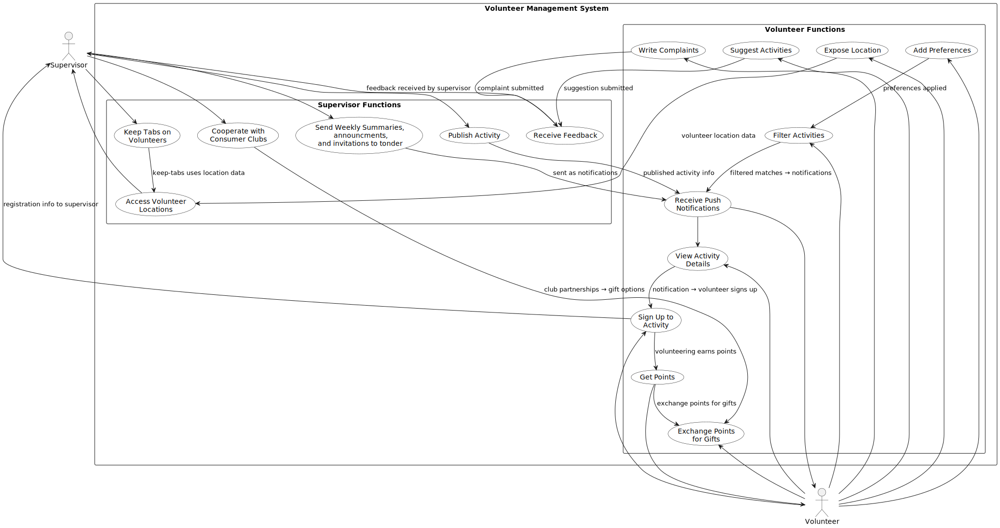

# 👐 Hamal Volunteers

## What is Hamal Volunteers
Hamal Volunteers is a complete, user-friendly system for organizing and managing volunteers and events. It helps keep track of people, events, capacity, and participation — all in one place.

## 🚀 Features

### Easy event system 🔥
* Create, update or cancel events in seconds.
* Set and adjust participant limits to avoid overbooking.
* View who has signed up, so you always know how many people are committed.

### Simple user interface
* Allow volunteers to personelize their prefrences.
* Recieve only the events that fits you perfectly
* You are also welcome to get out of your comfort zone and search other events 😄

# 📚 Architecture Diagram

